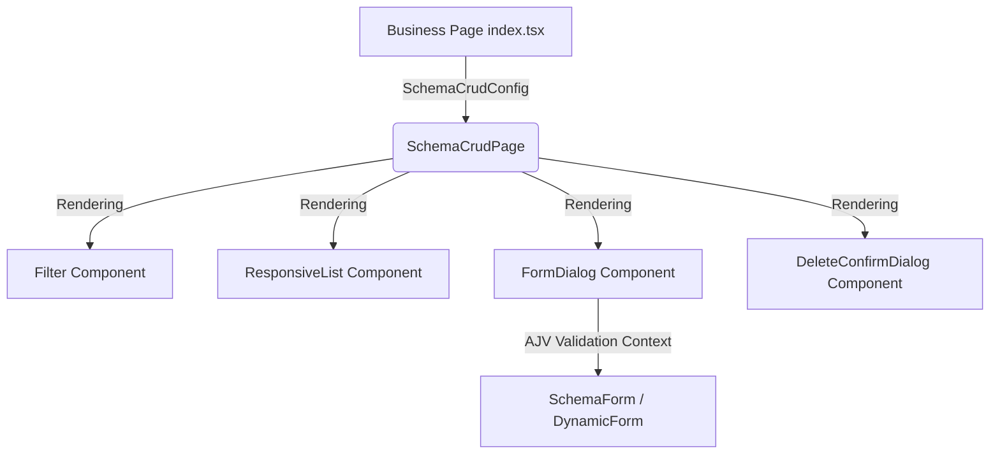

# OKFred 前端低代码/高配置化 CRUD 构建指南

本指南详细介绍了基于 **JSON Schema** 驱动的通用 CRUD 页面设计规范，用于指导开发人员在最少代码量下，快速搭建支持国际化、响应式、列表搜索、分页、弹窗编辑/新增及 AJV 规则校验的标准化 CRUD 模块。

---

## 🏗️ 整体架构体系

我们的 CRUD 架构基于**单点配置驱动模型（Configuration-Driven UI）**。一个标准的 CRUD 页面仅包含一个主入口 `index.tsx` 和一系列强类型的配置。核心渲染与状态机制由底座组件 `SchemaCrudPage` 自动接管，不需要手写琐碎的 UI 状态。



### 📁 目录及组件说明

所有的底层通用代码均封装在 `src/components/Crud` 下，目录结构如下：

- **`index.ts`**：公共类型与底座的统一导出入口。
- **`types.ts`**：定义了 `SchemaCrudConfig` 及各种核心类型。
- **`SchemaCrudPage.tsx`**：主调度中心组件，负责统一加载列表、分页控制、搜索防抖和增删改的核心事务。
- **`components/Filter.tsx`**：高精内聚的筛选栏（包含文字检索、下拉列表、折叠展开等）。
- **`components/FormDialog.tsx`**：弹出框表单（内置 AJV Validation 校验框架与响应式布局逻辑）。
- **`components/DeleteConfirmDialog.tsx`**：二次删除安全确认框。

---

## 🛠️ 如何快速构建一个新 CRUD 模块

要增加一个新的 CRUD 页面（例如以**国际化地区（Region）**页面为例），您只需要新建一个目录并创建以下 4 个小文件：

### 1. 筛选条件配置 `components/TheFilter.tsx`

定义表格上方的过滤器配置与类型：

```typescript
import type { FilterFieldConfig } from "@/components/Crud";

// 1. 定义筛选器的状态类型
export interface FilterState {
  keyword?: string;
  enabled?: boolean;
}

// 2. 导出 JSON-like 筛选器配置
export const filterConfig = {
  defaultFilters: {
    keyword: "",
    enabled: undefined,
  } as FilterState,

  // 基于国际化 t 函数和 extraContext 的动态字段定义
  fields: (t: any): FilterFieldConfig<FilterState>[] => [
    {
      name: "keyword",
      type: "text",
      label: t("filter.keyword"),
      placeholder: t("filter.keywordLabel"),
    },
    {
      name: "enabled",
      type: "select",
      label: t("region.fields.status"),
      options: [
        { label: t("region.status.all"), value: undefined },
        { label: t("region.status.enabled"), value: true },
        { label: t("region.status.disabled"), value: false },
      ],
    },
  ],
};
```

### 2. 表格与卡片字段 `components/TheTable.tsx`

定义 PC 端表格列、移动端卡片式展示（Card List）和自定义扩展行操作按钮：

```tsx
import type {
  TableColumnConfig,
  CardFieldConfig,
  CrudHelpers,
} from "@/components/Crud";
import type { RegionRes } from "@/api/i18n/type";
import { ToggleButton } from "@/components/Button"; // 假设有行内开关

export { type RegionRes };

export const tableConfig = {
  // 1. 定义 PC 表格列
  columns: (t: any, extraContext: any): TableColumnConfig<RegionRes>[] => [
    { title: t("region.fields.code"), dataIndex: "code" },
    { title: t("region.fields.name"), dataIndex: "name" },
    {
      title: t("region.fields.status"),
      render: (row, helpers) => (
        <ToggleButton
          checked={row.enabled}
          onChange={() => handleToggle(row, helpers)}
        />
      ),
    },
  ],

  // 2. 定义移动端卡片列表展示项
  cardFields: (t: any): CardFieldConfig<RegionRes>[] => [
    { label: t("region.fields.code"), dataIndex: "code" },
    { label: t("region.fields.name"), dataIndex: "name" },
  ],

  // 3. 灵活扩展其他行内操作按钮（例如自定义详情、审核等）
  actions: (t: any): any[] => [
    {
      key: "custom-view",
      icon: <InfoIcon />,
      permissionCodes: ["custom:view"],
      onClick: (row: RegionRes, helpers: CrudHelpers<RegionRes>) => {
        console.log("查看详情", row);
      },
    },
  ],
};
```

### 3. 表单校验与 Schema 定义 `components/TheForm.tsx`

配置 AJV 校验协议及表单的表层组件设计：

```tsx
import { JSONSchemaType } from "ajv";

export interface FormState {
  code: string;
  name: string;
}

// 1. 严格的 AJV JSON Schema 声明，错误提示信息高度定制化
export const formSchema: JSONSchemaType<FormState> = {
  type: "object",
  properties: {
    code: { type: "string", minLength: 2, errorMessage: "编码不能少于2个字符" },
    name: { type: "string", minLength: 1, errorMessage: "名称为必填项" },
  },
  required: ["code", "name"],
  errorMessage: {
    required: {
      code: "编码为必填项",
      name: "名称为必填项",
    },
  },
};

// 2. 导出表单的主体配置
export const formConfig = {
  schema: formSchema,
  defaultForm: {
    code: "",
    name: "",
  } as FormState,

  // 3. 渲染表单内部字段，可接收外部 context 比如关联数据源列表
  renderForm: (
    form: Partial<FormState>,
    setForm: React.Dispatch<React.SetStateAction<Partial<FormState>>>,
    isMobile: boolean,
    t: any,
    extraContext?: any,
  ) => {
    return (
      <Stack spacing={2}>
        <TextField
          label={t("region.fields.code")}
          value={form.code || ""}
          onChange={(e) =>
            setForm((prev) => ({ ...prev, code: e.target.value }))
          }
          fullWidth
        />
        {/* 可以直接在此消费 extraContext 动态渲染关联选择器 */}
      </Stack>
    );
  },
};
```

### 4. 组装主入口 `index.tsx` (零手写 Hooks)

极简声明，React Compiler 会在编译期接管全局状态防抖与缓存，无需添加任何 `useMemo` 与 `useCallback` 包裹：

```tsx
import { useState, useEffect } from "react";
import { SchemaCrudPage, type SchemaCrudConfig } from "@/components/Crud";
import { filterConfig, type FilterState } from "./components/TheFilter";
import { tableConfig, type RegionRes } from "./components/TheTable";
import { formConfig } from "./components/TheForm";
import * as RegionAPI from "@/api/i18n/region";
import { admin_i18n } from "@/hooks/usePermission";

export default function RegionPage() {
  const [languages, setLanguages] = useState([]);

  // 加载页面独立所需的级联/上下文数据源
  useEffect(() => {
    fetchLanguages().then(setLanguages);
  }, []);

  // 声明极其直观干净 of CRUD 行为契约
  const config: SchemaCrudConfig<RegionRes, FilterState, any, any> = {
    titleKey: "region.title",
    apiKeyName: "id", // 主键字段名，默认为 'id'
    permissions: {
      add: [admin_i18n.region.add],
      edit: [admin_i18n.region.edit],
      delete: [admin_i18n.region.delete],
    },
    api: {
      list: RegionAPI.listFn,
      add: RegionAPI.addFn,
      update: RegionAPI.updateFn,
      delete: RegionAPI.deleteFn,
    },
    filter: filterConfig,
    table: tableConfig,
    form: formConfig,
  };

  return <SchemaCrudPage config={config} extraContext={{ languages }} />;
}
```

---

## ⚡ 核心低代码运行逻辑

1. **高内聚的 `QueryState` 大对象状态集**：
   在底座内部，查询入参被完全内聚为一个单一的响应式状态大对象，避免了传统开发中 `page`, `pageSize`, `filters` 零散杂乱的问题：
   ```typescript
   export interface QueryState<TFilters> {
     page: number;
     pageSize: number;
     filters: TFilters;
   }
   ```
   这种高内聚设计不仅使组件体内的状态派发与更新更加集中规范，且大大缩减了数据拉取方法的参数个数（仅需 2 个参数，极大提升了测试性）。
2. **零心智负担缓存机制**：
   在 **React 19** 与 **React Compiler** 时代下，**切勿使用** `useMemo` 或 `useCallback` 去手动包裹配置或回调！React Compiler 能够精确识别纯函数、依赖引用，并在打包期自动生成高效的二进制缓存。我们的底座内没有任何禁用的 Eslint `react-hooks/exhaustive-deps` 忽略规则，这使得 React Compiler 可以 100% 优化整张页面，拒绝 Bailout。
3. **校验自动化**：
   底座通过 `useValidator` 加载 JSON Schema 并提供给 `useFormError`。当客户端或服务端校验返回错误时，校验上下文会自动把后端返回的字段错误精确绑定到表单具体的 Input 输入框上，实现秒级高亮。
4. **响应式自适应**：
   在 Mobile 端，底座会自动调用 `ResponsiveList` 切换至优雅的卡片流布局，并在打开表单时采用全屏抽屉式的 Dialog 呈现，在 Web 端则平滑回退至表格排版。
