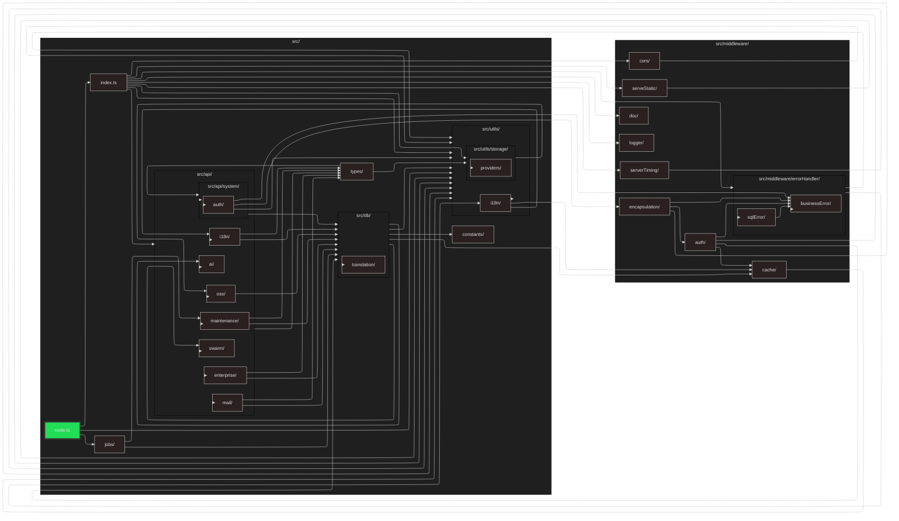

# RBAC Server

A high-performance, production-ready permission management backend service designed for Cloudflare Workers and Node.js hybrid deployments.

[中文说明 (README_zh_CN.md)](README_zh_CN.md)

## 🛠️ Quick Start

### Prerequisites

Ensure you have the following installed:

- [Node.js](https://nodejs.org/) (Recommended v18+)
- [pnpm](https://pnpm.io/)
- [Cloudflare Wrangler](https://developers.cloudflare.com/workers/wrangler/install-and-update/) (Required for D1 synchronization)

### Database Initialization (DDL)

Table structures are no longer automatically created at startup. Execute the appropriate command based on your target environment:

- **Node/Local File Mode** (Please create a db file, and set up the environment variable called DB_FILE_NAME):

  ```bash
  pnpm run db:init node
  ```

- **Cloudflare D1 Local Environment**:

  ```bash
  pnpm run db:init worker
  ```

- **Cloudflare D1 Remote Production Environment**:
  ```bash
  pnpm run db:init worker remote
  ```

### Local Development

- **Node.js Mode**:

  ```bash
  pnpm run dev
  ```

- **Worker Local Mode**:
  ```bash
  pnpm run worker:dev
  ```

## 📊 Dependency Graph

<!-- DEPENDENCY_GRAPH_START -->



<!-- DEPENDENCY_GRAPH_END -->
